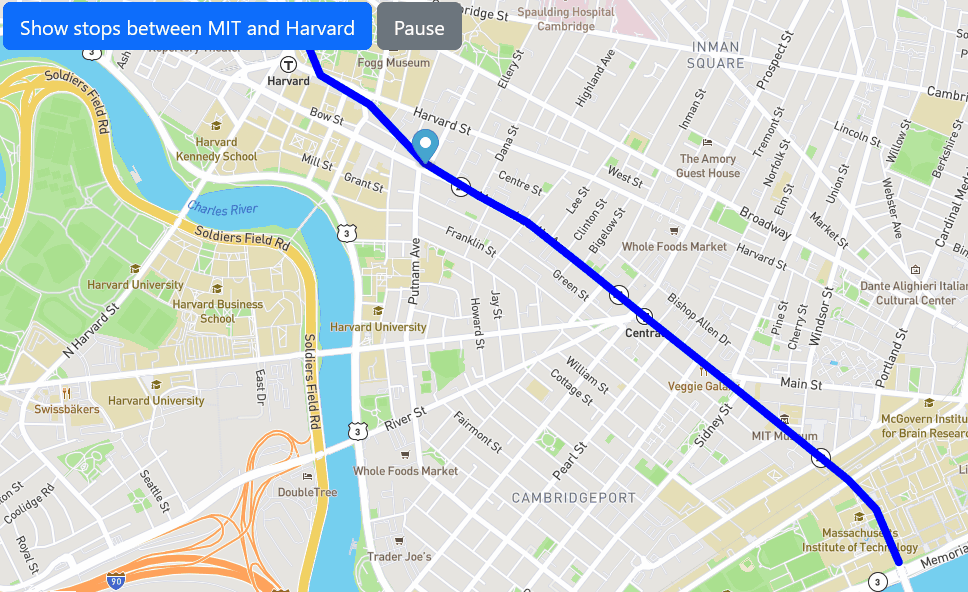

 
  

  &#xa0;

  <!-- <a href="https://-MITRealTimeBus.netlify.app">Demo</a> -->

<h1 align="center">-MITRealTimeBus</h1>

  

  

  

  

  <!--  -->

  <!--  -->

  <!--  -->

<!-- Status -->

<!-- <h4 align="center"> 
	🚧  -MITRealTimeBus 🚀 Under construction...  🚧
</h4> 

 -->

  <a href="#dart-about">About</a> &#xa0; | &#xa0; 
  <a href="#sparkles-roadmap">Roadmap</a> &#xa0; | &#xa0;
  <a href="#rocket-run">How to run</a> &#xa0; | &#xa0;
  <a href="#memo-license">License</a> &#xa0; | &#xa0;
  <a href="https://github.com/GaferCarla" target="_blank">Author</a>

 

## :dart: About ##

This is an assigmnent for MitxPro Full development with MERN. This exercise works with asynchronous code and APIs. The goal of this project was to track the bus stops between MIT and Harvard. 

## :sparkles: Roadmap ##

:heavy_check_mark: I would like to add a real-time bus tracker.\

## :rocket: How to run ##

The app contains two buttons. The first "Show stop between MIT and Harvard" initializes the animation of the bus line stops. The second "Pause" button stops the tour.
To continue, just click the "Show..." button again.

If you want to know how look, click <a href="https://gafercarla.github.io/--MITRealTimeBus/">here</a>

## :memo: License ##

This project is under license from MIT. For more details, see the [LICENSE](LICENSE.md) file.

Made with :heart: by <a href="https://github.com/GaferCarla" target="_blank">Gafer</a>

&#xa0;

<a href="#top">Back to top</a>
